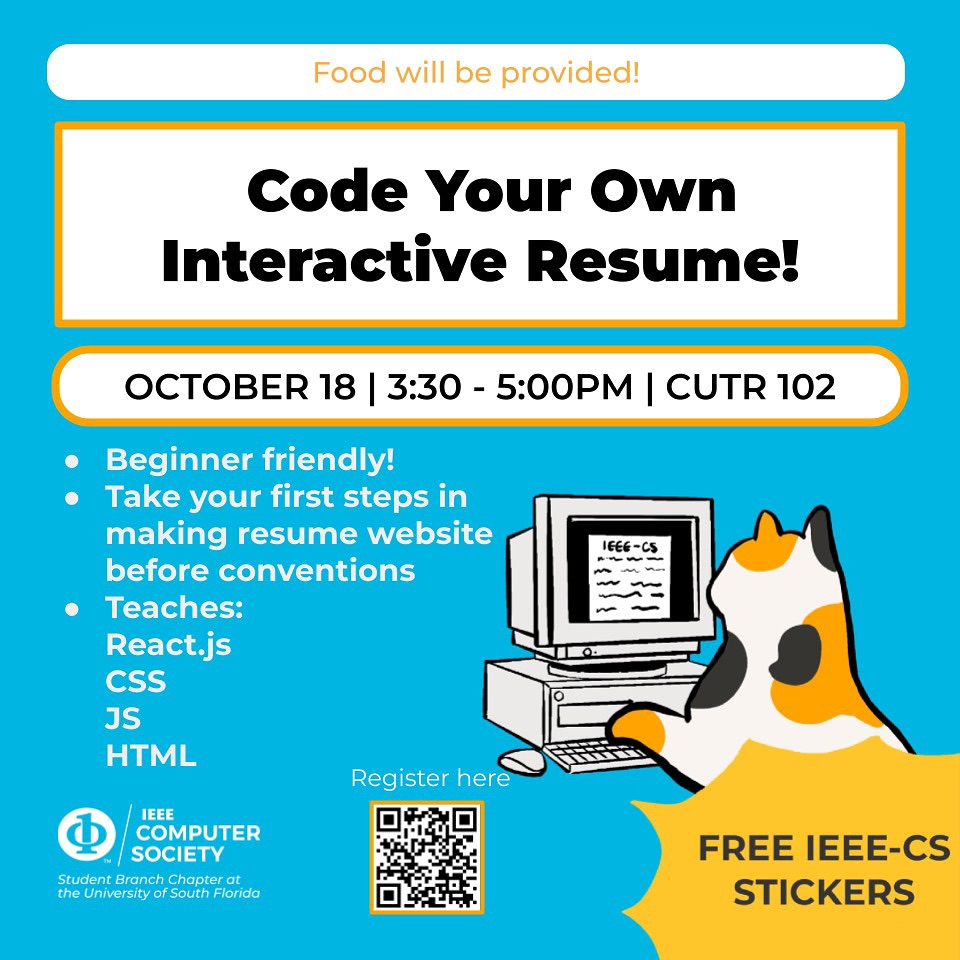

# Code an Interactive Resume



A workshop run by the IEEE Computer Society student branch chapter at the University of South Florida, taught by tech lead Sneha. A resume you can send as a link lands differently at a career fair than a PDF does, which was the whole point.

Friday, October 18, 2024, 3:30 to 5:00 PM, CUTR 102. Weather and room closures pushed it back more than once before it finally ran.

## What we built

A single-page resume site in React, with sections for an about page, projects, and contact details. HTML and CSS for the layout, Firebase for anything that needs to persist.

## Running it

```bash
npm install
npm run dev
```

Vite serves it with hot reload. Swap the images in `src/assets` and edit the components in `src/` to make it yours.

## Links

- [Announcement on Instagram](https://www.instagram.com/p/DBKqio-R-Yj/)
